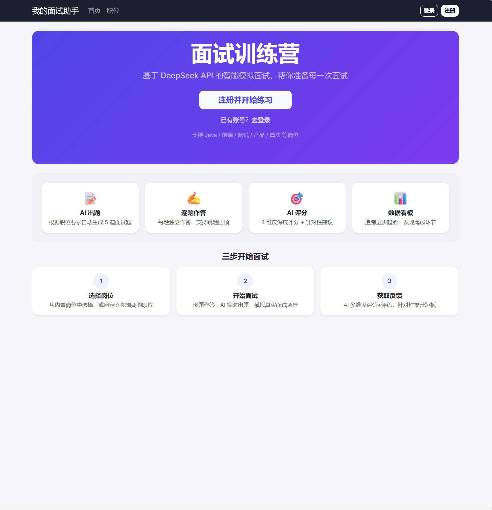
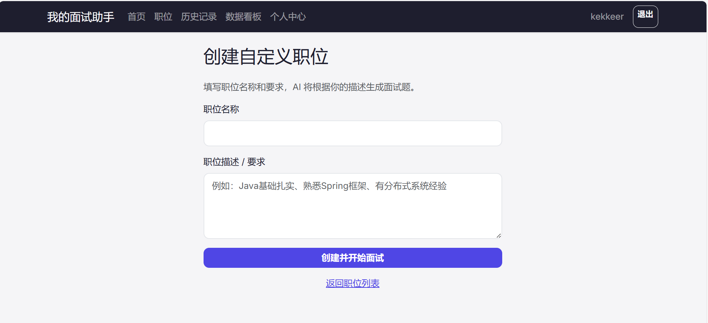
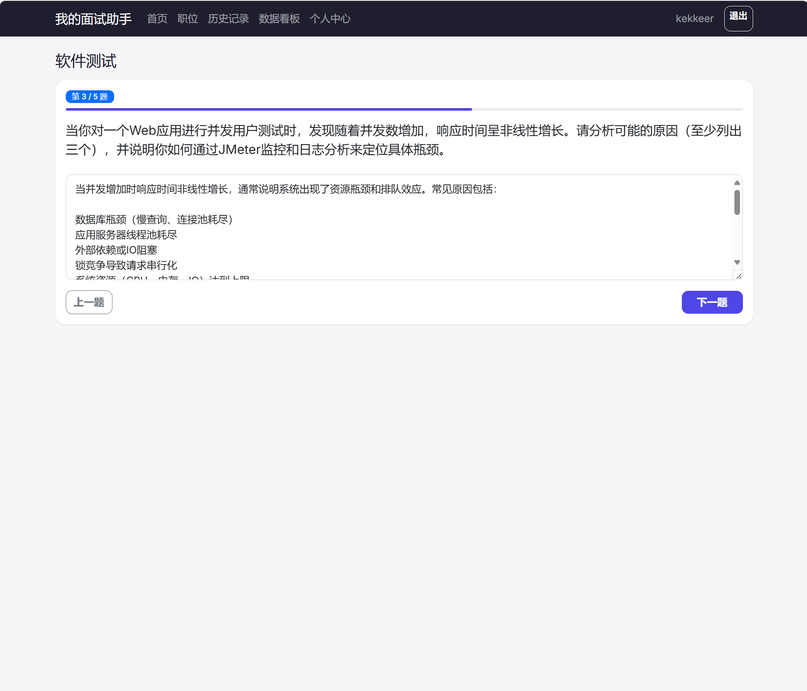
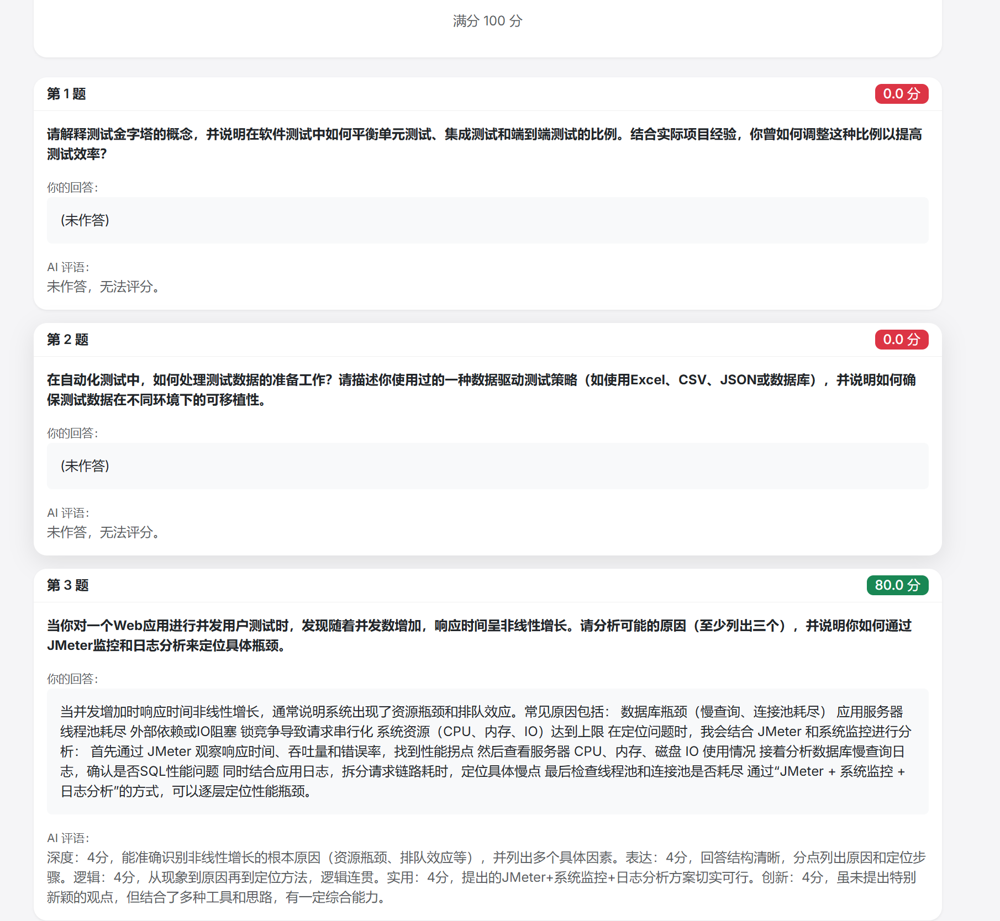
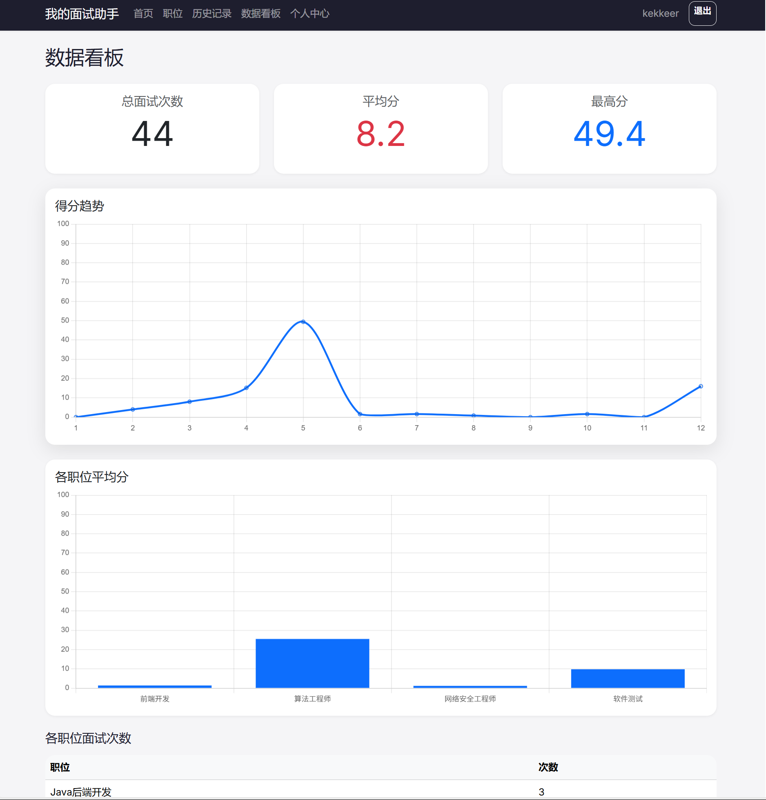
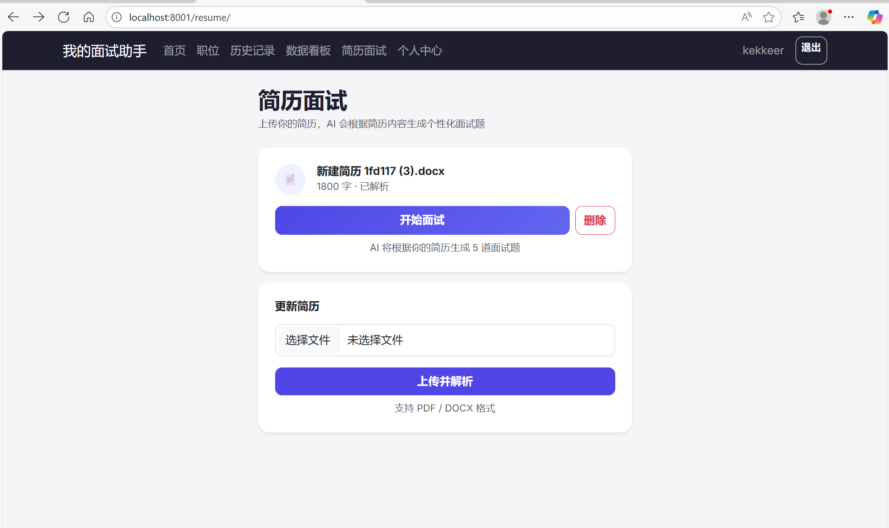
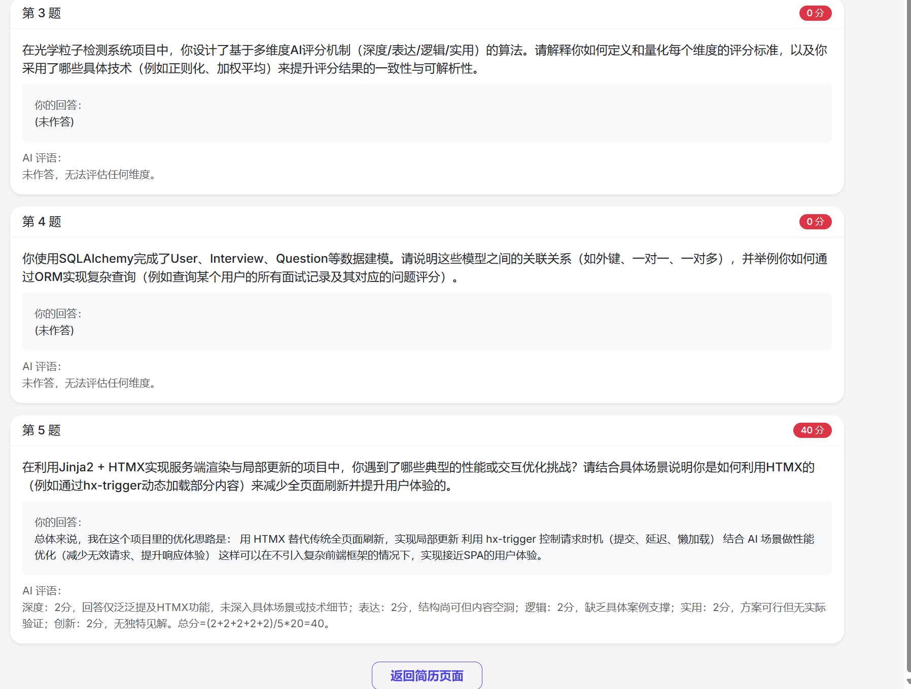

# AI 面试助手

每次面试前都很慌？不知道会问什么？AI 面试助手模拟真实技术面试场景，AI 出题、逐题作答、智能评分，让你在正式面试前就找到状态。

---

## 功能特性

- **AI 智能出题** — 根据职位要求自动生成 5 道面试题，贴近真实面试场景
- **简历 RAG 面试** — 上传 PDF / DOCX 简历，经过向量检索 + LLM 生成个性化面试题
- **逐题作答** — 每题独立作答，支持上下题切换，答案自动保存
- **AI 多维评分** — 深度 / 表达 / 逻辑 / 实用 4 维度评分 + 针对性评语
- **Prompt 工程** — 出题 / 评分 / RAG 多套 prompt 模板，保证结构化 JSON 输出
- **职位管理** — 5 个内置职位（Java后端 / 前端 / 测试 / 产品 / 算法）+ 自定义职位
- **数据看板** — 得分趋势折线图 + 各职位平均分柱状图
- **历史记录** — 分页列表 + 按职位筛选 + 查看详情
- **用户系统** — JWT 认证 + 密码加密（bcrypt）

---

## RAG 简历面试架构

```
用户上传简历（PDF / DOCX）
    ↓
┌─ document_parser.py ──────────────────────┐
│  pdfplumber（PDF）或 python-docx（DOCX）   │
│  提取纯文本，限制 max 5000 字符             │
└───────────────────────────────────────────┘
    ↓
┌─ rag_service.py ───────────────────────────┐
│  chunk_text：按 300 字切分文本片段           │
│  SentenceTransformer（all-MiniLM-L6-v2）    │
│    → 每个 chunk 编码为 384 维向量            │
│  FAISS IndexFlatL2：向量索引存储 + 相似度检索 │
└────────────────────────────────────────────┘
    ↓
┌─ generate_from_resume() ───────────────────┐
│  用户点击"开始面试"                           │
│  → FAISS 检索 top-3 相关简历片段              │
│  → 拼接成 context → 构造 prompt → DeepSeek   │
│  → 解析 JSON → 返回 5 道个性化面试题          │
└────────────────────────────────────────────┘
    ↓
┌─ resume/take.html → submit → scoring ──────┐
│  用户作答 → 提交 → DeepSeek 4维度评分 → 结果页 │
└────────────────────────────────────────────┘
```

**RAG 核心文件：**
| 文件 | 功能 |
|------|------|
| `services/document_parser.py` | PDF / DOCX 解析，提取纯文本 |
| `services/rag_service.py` | 文本切分 → embedding → FAISS 索引 → 检索 → prompt 拼接 → DeepSeek 出题 |
| `models/resume.py` | Resume 数据模型（user_id, filename, content, status）|
| `routers/resume.py` | 简历上传 / 删除 / RAG 面试 / 答题 / 评分全流程路由 |

---

## Prompt 工程

项目包含多套面向 DeepSeek 的 prompt 模板，针对不同任务分别设计：

### 岗位面试出题 Prompt

```
系统角色：你是一名资深技术面试官
用户输入：职位名称 + 职位描述 + 需要避免的已出题目
输出格式：强制 JSON，{questions: [{content, order}]}
温度参数：1.0（高随机性，避免每轮题目重复）
容错机制：正则提取 markdown 代码块 → json.loads → 空结果检查 → 截断到预期数量
```

### 简历 RAG 出题 Prompt

```
输入：FAISS 检索到的 top-3 简历 chunk
系统角色：你是一名资深技术面试官，基于候选人简历内容出题
输出格式：强制 JSON，{questions: [{content, order}]}
约束：题目必须围绕简历中的技术栈和项目经验
```

### 多维度评分 Prompt

```
输入：全部题目 + 用户回答（一次性批处理，省 token）
系统角色：资深面试官，从 5 个维度评分
评分维度：
  - 深度（1-5）：是否理解问题本质
  - 表达（1-5）：回答是否清晰有条理
  - 逻辑（1-5）：论证是否严谨
  - 实用（1-5）：解决方案是否可行
  - 创新（1-5）：回答是否有独特见解
每题得分 = (depth + expression + logic + practical + innovative) / 5 × 20（百分制）
输出格式：强制 JSON，{scores: [{order, score, comment}], summary}
```

---

## 技术栈

| 层级 | 技术 |
|------|------|------|
| 后端框架 | FastAPI (Python 3.14) |
| 数据库 | SQLAlchemy ORM + SQLite（开发）/ PostgreSQL（生产）|
| 模板引擎 | Jinja2 |
| 前端 | Bootstrap 5 + HTMX（局部刷新）|
| 图表 | Chart.js |
| AI 接口 | DeepSeek API（OpenAI 兼容）|
| 认证 | JWT (python-jose) + bcrypt |
| 向量检索 | sentence-transformers + FAISS |
| 文档解析 | pdfplumber（PDF）、python-docx（DOCX）|
| 部署 | Railway / Render / Zeabur |

---

## 快速开始

```bash
# 克隆仓库
git clone https://github.com/kekkeer/AI-interview-assistant.git
cd ai-interview-assistant

# 创建虚拟环境
python -m venv .venv
# Windows
.venv\Scripts\activate
# macOS / Linux
source .venv/bin/activate

# 安装依赖
pip install -r requirements.txt

# 配置环境变量
cp .env.example .env
# 编辑 .env，填入你的 DEEPSEEK_API_KEY

# 启动服务
uvicorn app.main:app --reload
```

首次启动时会自动下载 sentence-transformers 模型（~80MB），请保持网络畅通。

---

## 环境变量

| 变量 | 必填 | 说明 |
|------|------|------|
| `DEEPSEEK_API_KEY` | ✅ | DeepSeek API Key |
| `SECRET_KEY` | ✅ | JWT 加密密钥（生成：`python -c "import secrets; print(secrets.token_hex(32))"`）|
| `DATABASE_URL` | ❌ | 数据库地址（默认 SQLite，生产环境用 PostgreSQL）|

---

## 项目结构

```
ai-interview/
├── app/
│   ├── main.py              # FastAPI 入口
│   ├── config.py            # 配置管理（pydantic-settings）
│   ├── database.py          # SQLAlchemy 引擎 + 会话
│   ├── render.py            # 模板渲染 + 当前用户注入
│   ├── models/              # 数据模型
│   │   ├── user.py          # User
│   │   ├── interview.py     # Position / Interview / Question
│   │   └── resume.py        # Resume（简历 RAG）
│   ├── routers/             # 路由
│   │   ├── auth.py          # 注册 / 登录 / 登出 / 修改密码
│   │   ├── positions.py     # 职位列表 / 创建 / 出题
│   │   ├── interview.py     # 答题 / 评分 / 结果 / 历史
│   │   ├── dashboard.py     # 数据看板
│   │   └── resume.py        # 简历上传 / RAG 面试 / 评分
│   ├── services/            # 业务逻辑
│   │   ├── auth_service.py  # 密码哈希 / JWT
│   │   ├── ai_service.py    # DeepSeek 出题
│   │   ├── scoring_service.py # AI 评分
│   │   ├── rag_service.py   # 简历 chunk / embedding / FAISS 检索 / 出题
│   │   ├── document_parser.py # PDF + DOCX 解析
│   │   └── seed.py          # 种子数据（5个内置职位）
│   ├── templates/           # HTML 模板
│   │   ├── auth/            # 登录 / 注册
│   │   ├── interview/       # 答题 / 结果
│   │   ├── positions/       # 职位列表 / 创建
│   │   └── resume/          # 简历上传 / RAG 答题 / 结果
│   └── static/              # CSS 样式
├── docs/                    # 截图
├── requirements.txt
├── Procfile                 # 部署配置
└── README.md
```

---

## 截图









---

## License

MIT
